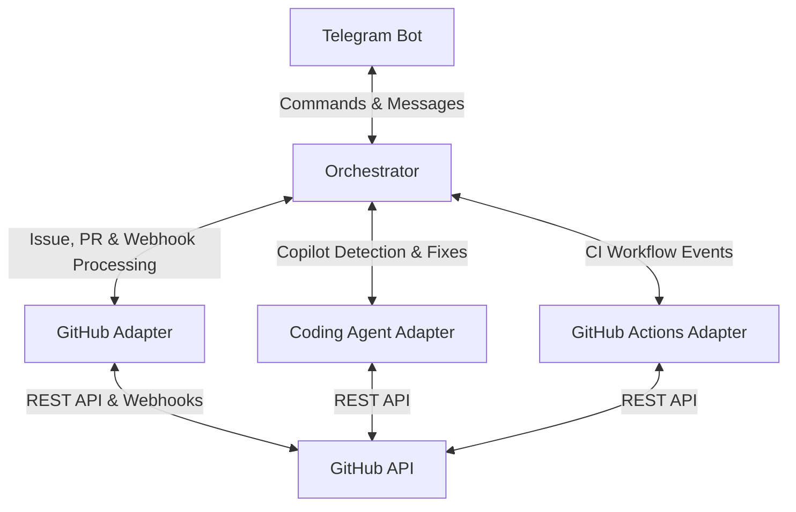
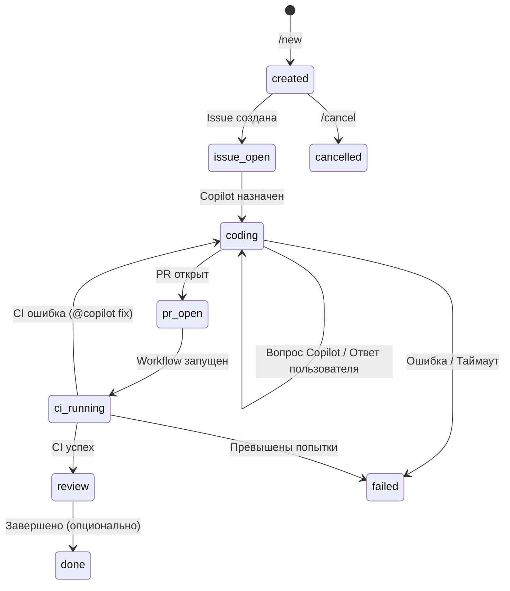
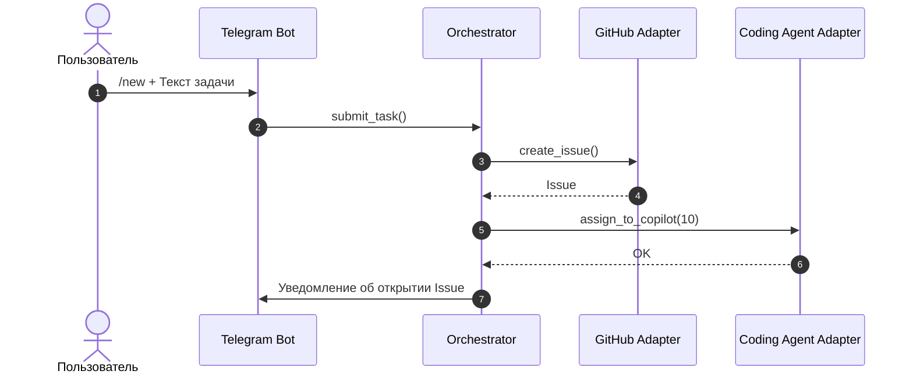
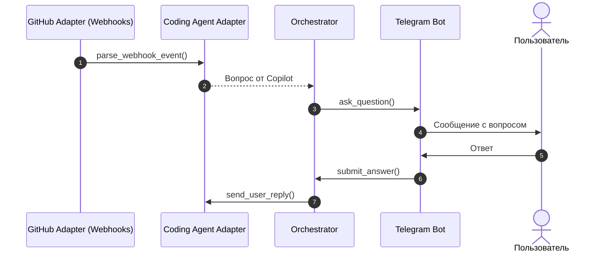
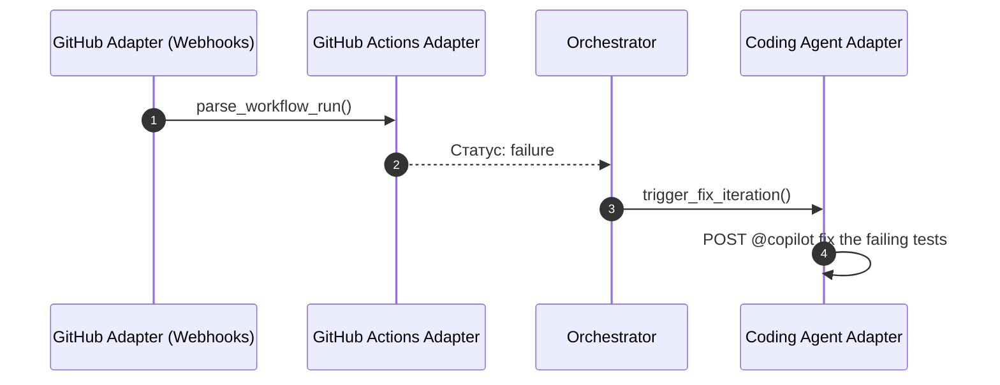

# Описание Архитектуры Прототипа (Architecture Description)
## Минимально жизнеспособный прототип (MVP) интеграции Telegram, GitHub Copilot Coding Agent и GitHub Actions

**Версия документа:** 1.1  
**Дата:** 7 августа 2026 г.  
**Язык:** Русский  

---

## 1. Общая схема прототипа

Архитектура прототипа спроектирована для проверки взаимодействия пяти ключевых логических компонентов:

1. **Telegram Bot** — пользовательский интерфейс.
2. **Orchestrator** — управление состоянием и координация.
3. **GitHub Adapter** — взаимодействие с GitHub REST API и приём вебхуков.
4. **Coding Agent Adapter** — обработка взаимодействия с Copilot.
5. **GitHub Actions Adapter** — обработка событий CI.

---

## 2. Логические компоненты прототипа

### 2.1. Telegram Bot

- Принимает команды пользователя (`/start`, `/new`, `/status`, `/cancel`).
- Реализует диалог подтверждения задачи через интерактивные кнопки.
- Передаёт ответы пользователя на вопросы Copilot в Orchestrator.
- Отправляет пользователю уведомления о статусе и результатах выполнения задачи.

### 2.2. Orchestrator

- Управляет состоянием каждой задачи на всём протяжении пайплайна.
- Допустимые состояния задачи:
  - `created` — задача принята от пользователя.
  - `issue_open` — Issue открыта на GitHub.
  - `coding` — Copilot выполняет кодинг или задаёт уточняющие вопросы.
  - `pr_open` — Pull Request открыт.
  - `ci_running` — выполняются CI-тесты в GitHub Actions.
  - `review` — опциональный этап AI-ревью кода.
  - `done` — задача завершена успешно.
  - `failed` — ошибка выполнения.
  - `cancelled` — задача отменена пользователем.
- Управляет логикой повторных попыток при сбое тестов (ограничение `MAX_RETRIES`).
- Хранит текущий контекст задачи в оперативной памяти процесса (in-process state). Постоянное хранилище не входит в MVP.

### 2.3. GitHub Adapter

- Выполняет базовые операции через GitHub REST API: создание Issue, публикация комментариев, получение данных о Pull Request.
- Принимает входящие вебхуки от GitHub.
- Проверяет подлинность входящих вебхуков по HMAC SHA-256 подписи.

### 2.4. Coding Agent Adapter

- Назначает созданную Issue на `github-copilot[bot]`.
- Парсит комментарии к Issue для обнаружения уточняющих вопросов от Copilot.
- Отправляет ответы пользователя обратно в комментарии к Issue.
- Формирует и публикует команду `@copilot fix the failing tests` с прикреплённым фрагментом лога падения CI.

### 2.5. GitHub Actions Adapter

- Обрабатывает события `workflow_run` от вебхуков GitHub.
- Определяет итоговый статус CI-проверок: успех (`success`) или ошибка (`failure`).
- Извлекает фрагмент лога ошибок при сбое тестов для передачи в Coding Agent Adapter.

---

## 3. Схема переходов состояний

---

## 4. Схемы взаимодействия (Sequence Diagrams)

### 4.1. Поток передачи задачи и назначения Copilot

### 4.2. Поток вопроса от Copilot и ответа пользователя

### 4.3. Поток отслеживания GitHub Actions и повторного запроса к Copilot

---

## 5. Развёртывание

- Развёртывание прототипа выполняется в Docker через `docker compose up --build`.
- Приложение запускается в одном контейнере, содержащем веб-сервер (точка приёма вебхуков) и Telegram Bot.
- Постоянное (persistent) хранилище состояния в рамках MVP не предусмотрено. Состояние хранится in-process и сбрасывается при перезапуске контейнера.
